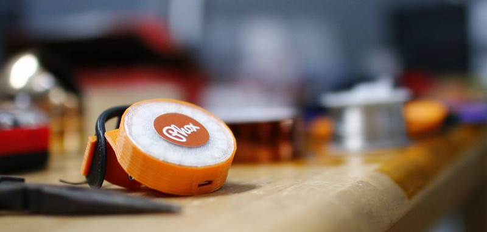

PhoxTailLight
------------

Phox TailLight is a bicycle taillight built around an RGB LED ring that can display custom running light animations, brake lights and turn signal animations. It's wifi enabled so connecting new components is a snap. Plus, use your phone to configure it. Tight!  

Development
------------
There are a few tools required to develop this stuff:
* \*nix box with make, gcc, the usual stuff
* [makeEspArduino makefile](https://github.com/plerup/makeEspArduino)
* [ArduinoEsp](https://github.com/esp8266/Arduino)

First, clone this repo. Be sure to include `--recursive` so that it will pull down submodules:

    git clone --recursive https://github.com/Phoxlights/PhoxTailLight.git

Then update the makefile to point to your local copy of the makeEspArduino and the ArduinoEsp repo:

    ESP_MAKE=$(HOME)/src/makeEspArduino
    ESP_LIBS=$(HOME)/src/ArduinoEsp/libraries

Finally, hook up your esp8266 and try `make upload`. Will it work? Probably!

Releasing
-----------
Use the [git flow](http://nvie.com/posts/a-successful-git-branching-model/) release process. 

Release checklist:
* Bump to BIN_VERSION in whatever sketch (TODO - automatically pull this from VERSION)
* Build a new bin and put it in `build`. This can be done with `make build`.
* Update `CHANGELOG`
* Make sure submodules are pinned to a release tag
* *After* release, bump the version in `VERSION` and push to develop
